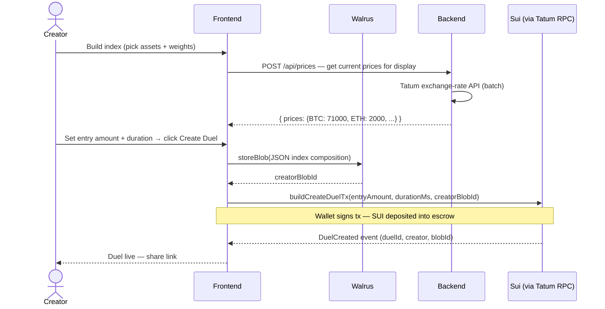
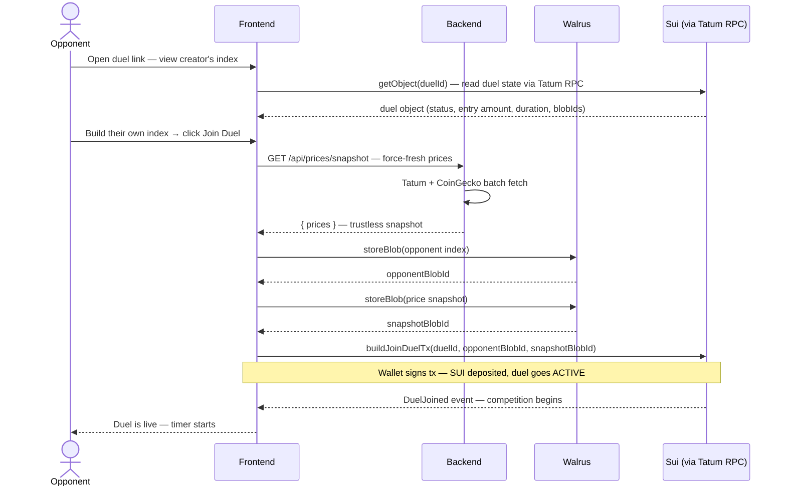
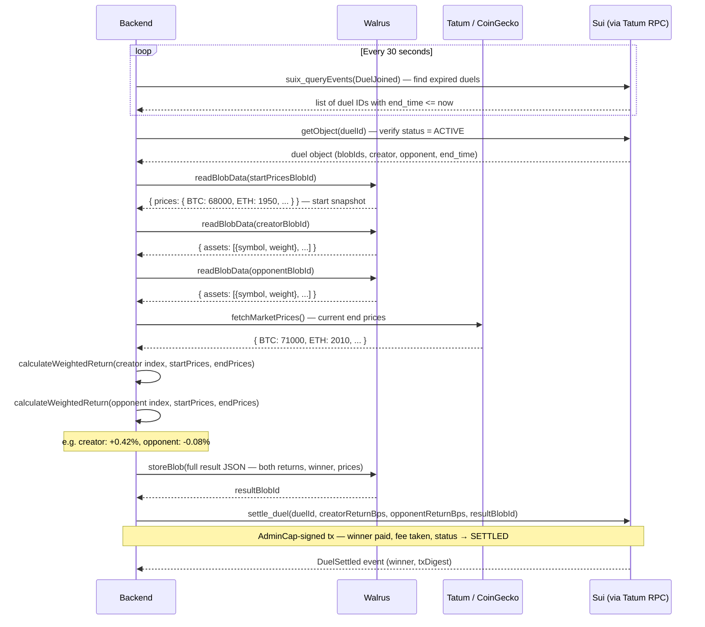
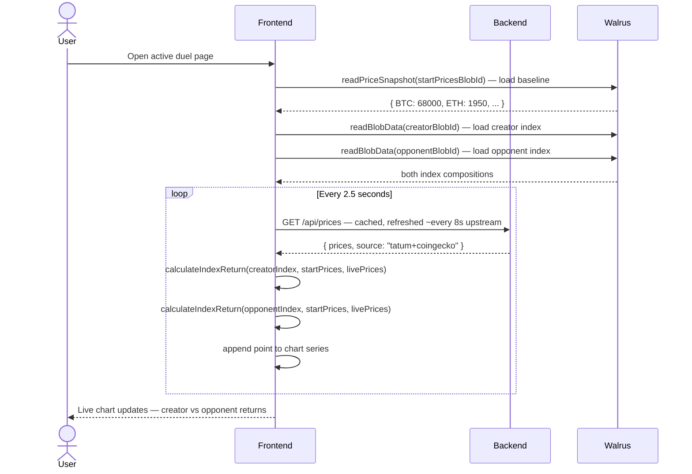

# Sui-Index — Build. Duel. Win.

> **Tatum × Build on Sui with Walrus — Hackathon Submission**
>
> *The first skill-based crypto index duel game on Sui — turning market conviction into head-to-head competition instead of a boring yes/no bet.*

---

## 1. What is Sui-Index?

Sui-Index is an on-chain **crypto index duel game** on Sui. Players don't bet yes or no on future events. Instead, they build a custom weighted portfolio of crypto assets and compete 1v1 — the better-performing index wins the prize pool.

```
BUILD  →  Pick 3–8 crypto assets and assign % weights (e.g. 40% BTC, 30% ETH, 20% SOL, 10% SUI)
LOCK   →  Your index is stored immutably on Walrus; its blob ID is committed to the Sui smart contract
DUEL   →  1v1 match for a set time window — both players' SUI is locked in trustless escrow
SETTLE →  Price feeds determine the best-performing index by weighted return
EARN   →  Winner takes the prize pool (minus 2% platform fee)
FLEX   →  Share your result card — stored on Walrus — on X or LinkedIn
```

No house edge. Pure peer-to-peer. Your index is your strategy, your identity, and your permanent on-chain record.

---

## 2. Market Opportunity

The prediction market sector is in explosive, documented growth — making this exactly the right time to build a differentiated alternative.

| Metric | Value | Source |
|---|---|---|
| Total notional volume (2025) | **$44–51 billion** across all prediction markets | Research aggregates |
| Monthly growth | $1.2B (early 2025) → **$20B+ (Jan 2026)** → **$29.8B (Apr 2026)** | Market reports |
| Polymarket alone | **$25.7B** in March 2026; Q1 2026 ~$26.2B (+90% QoQ) | Polymarket data |
| Kalshi April 2026 | **$14.8B** in trading volume (+13% MoM) | Kalshi data |
| Bernstein forecast | **$240B** industry volume in 2026 → **$1 trillion/year by 2030** (80% CAGR) | Bernstein Research |
| Active users (Q1 2026) | **1.29M active wallets** on Polymarket alone | On-chain analytics |
| Retail share | **82.3%** of users have <$10K volume — casual, game-like audience | Polymarket analysis |

This is a validated, high-growth category. The window to build a better alternative has never been more open — because the market leaders are collapsing under regulatory pressure precisely as volume peaks.

---

## 3. The Problem — Why Now?

### 3.1 The Regulatory Wipeout Is Happening Right Now

Polymarket and Kalshi now face a global wave of bans accelerating by the week. The core regulatory complaint is always the same: *these platforms are classified as unlicensed gambling because users are betting on uncertain future events for money.*

| Country / Region | Status |
|---|---|
| Spain | Blocked May 2026 — investigation launched, ISPs legally mandated to cut access |
| India | Blocked May 2026 under online gambling restrictions |
| Indonesia | Blocked May 2026 |
| Brazil | Blocked April 2026 |
| Argentina | Suspended March 2026 |
| France, Belgium, Germany, Netherlands | Blocked (France/Belgium since 2024) |
| Australia, Switzerland, Italy, Poland, Romania, Hungary, Portugal, Taiwan, Thailand, Japan, China, Ukraine | Restricted or blocked |
| Minnesota (USA) | First US state to pass a law banning prediction markets |
| 14 other US states | Active legislation pending |

Polymarket officially lists **33 blocked countries** on its own website. Both Polymarket and Kalshi have been blocked in or restricted from 30+ jurisdictions in just 12 months.

### 3.2 Retail Users Are Getting Destroyed by Bots

Bloomberg's April 2026 analysis of Polymarket data revealed a structural problem that no UI polish can fix:

- **100,000+ accounts** each lost at least $1,000 on Polymarket since early 2025
- That is nearly **twice the number that made $1,000+**
- Systematic bots are the **primary winners** across most market categories

Retail players on traditional prediction markets are essentially subsidizing algorithmic traders. It is not a game — it is a trap with a game-like interface.

### 3.3 Existing Products Are One-Dimensional and Dry

- Single yes/no outcomes with **no strategy expression**
- No social identity or reputation built around prediction skill
- Illiquid markets that are hard to exit early
- Full collateralization requirements that lock capital
- Opaque AMM pricing casual users cannot easily understand
- No creativity — everyone bets the same binary way

---

## 4. The Solution

Sui-Index reframes the product entirely. You are not betting on an event outcome. You are **competing in a skill-based index performance game** using public market data — structurally closer to a trading simulation game or a fantasy sports league for DeFi.

### Core Loop

```
BUILD (Pick assets + weights)
  → LOCK (Walrus stores your index permanently)
    → DUEL (Smart contract holds escrow, competes the indexes)
      → SETTLE (Price feeds determine winner — fully on-chain)
        → EARN (Winner takes pool)
          → FLEX (Share your index card on X / LinkedIn)
```

### Key Design Choices

| Decision | Why |
|---|---|
| No house edge | Pure peer-to-peer escrow — creator stakes, opponent stakes, contract settles |
| Skill over luck | Your index composition reflects your market thesis; a thoughtful allocation beats a random one over time |
| Locked at start | Index is immutable once submitted — no changing your mind mid-duel, no front-running |
| Public leaderboard on Walrus | Top builders by win rate and total return build permanent, verifiable reputations |
| Walrus-hosted frontend | The full dApp lives on Walrus — no domain for governments to block |
| Non-custodial | Funds never leave the user's wallet except into the duel escrow contract |

---

## 5. Competitive Landscape — What Makes Sui-Index Unique

A feature-by-feature breakdown across the dimensions that actually matter to judges and users.

| Feature | Polymarket | Kalshi | Augur | **Sui-Index** |
|---|---|---|---|---|
| **Strategy Depth** | ✕ Yes/No only | ✕ Yes/No only | ✕ Yes/No only | ✅ Full weighted index across 3–8 assets |
| **Bot Resistance** | ✕ 100K+ users lost $1K+ to bots | ✕ High bot exposure | ~ Moderate | ✅ Index locked at duel start — no live order book |
| **Regulatory Safety** | ✕ Banned in 33+ countries | ~ US only (CFTC-licensed) | ~ Grey area | ✅ Index game framing — not event gambling |
| **Social Layer** | ✕ None | ✕ None | ✕ None | ✅ Profiles, leaderboards, shareable index cards |
| **Censorship Resistance** | ✕ ISP-blockable domain | ✕ Centralized server | ~ Partial | ✅ Full dApp hosted on Walrus — no DNS to block |
| **Decentralized Storage** | ✕ Centralized | ✕ Centralized | ✕ On-chain (expensive) | ✅ Walrus blob storage — cheap, native to Sui |
| **Game Layer** | ✕ None | ✕ None | ✕ None | ✅ 1v1 duels + tournaments + rematches |
| **Chain** | Polygon | Centralized | Ethereum | ✅ Sui — fastest-growing L1 |

### Key Differentiators

**🛡️ Regulatory Safety** — Index duels are framed as skill-based games, not event gambling, avoiding the legal classification that got Polymarket banned in 33+ countries and counting.

**🤖 Bot Resistance** — Indexes are locked at duel creation. There is no live order book for bots to exploit. Strategy beats latency.

**🌊 Walrus Storage** — Index history, leaderboards, duel metadata, and the full dApp frontend live on Walrus — no central server to block or seize.

**⚡ Tatum RPC** — Every Sui RPC call routes through Tatum's enterprise gateway — 99.99% uptime, geo-load balanced, sub-50ms latency.

---

## 6. How Tatum Powers Sui-Index

> **Tatum is the blockchain infrastructure layer** — it provides managed Sui RPC nodes, a Data API for wallet balances and token prices, and event indexing. Think of it as AWS for blockchain: instead of running your own Sui node, you plug in Tatum and get sub-50ms latency, 200 req/s, 99.99% uptime SLA, and Smart RPC Routing (auto geo/load balancing with failover) out of the box.

Every single user action in Sui-Index flows through Tatum — this is not an add-on integration.

| Feature | How Sui-Index Uses It |
|---|---|
| **Sui Testnet / Mainnet RPC** | All contract reads and writes — duel create, join, settle, payout |
| **Smart RPC Routing** | Auto geo-balanced + failover: duels never fail due to RPC downtime |
| **RPC Accelerator** | Cached blockchain state for faster leaderboard and duel-list reads |
| **Wallet Balance API** | Real-time SUI balance check before a player joins a duel |
| **Exchange Rate API** | Batch price fetch for the live dashboard and settlement engine (Tatum mainnet key) |
| **Event Indexing** | `DuelCreated` / `DuelJoined` / `DuelSettled` events queried via Tatum RPC |

```typescript
// frontend/src/lib/tatum.ts — ALL Sui RPC calls route through Tatum
export function getTatumRpcUrl(): string {
  return TATUM_API_KEY
    ? `https://sui-testnet.gateway.tatum.io`
    : getFullnodeUrl('testnet'); // fallback only
}

// backend/src/index.ts — settlement service & price API also use Tatum
const TATUM_RPC = {
  testnet: 'https://sui-testnet.gateway.tatum.io',
  mainnet: 'https://sui-mainnet.gateway.tatum.io',
};

// Exchange rate batch fetch — Tatum Data API (mainnet key)
const res = await fetch('https://api.tatum.io/v4/data/rate/symbol/batch', {
  method: 'POST',
  headers: { 'x-api-key': TATUM_MAINNET_API_KEY },
  body: JSON.stringify(symbols.map(sym => ({ batchId: sym, symbol: sym, basePair: 'USD' }))),
});
```

---

## 7. How Walrus is Used

Walrus is Sui's decentralized blob storage protocol. It uses "Red Stuff" encoding — breaking blobs into shards distributed across storage nodes — making data resilient to node failures while remaining cost-efficient. Walrus is the **core data layer** for Sui-Index, not an add-on.

| Data | Stored on Walrus | Why Walrus |
|---|---|---|
| Index composition | JSON blob per player per duel (assets + weights + timestamp) | Immutable, verifiable before and after settlement |
| Start price snapshot | Prices at the moment the opponent joins | Trustless baseline — no oracle manipulation possible |
| Duel result | Full settlement record (returns, winner, end prices) | Permanent proof of outcome |
| Leaderboard snapshots | Weekly and all-time rankings | Decentralized — no central server to shut down |
| Social share cards | Index card metadata for X/LinkedIn sharing | Rich media blob — Walrus's primary use case |
| **Full dApp frontend** | Entire Next.js UI hosted as a Walrus Site | **Cannot be ISP-blocked** — the regulatory moat |

```typescript
// frontend/src/lib/walrus.ts

// Store index blob at duel creation
const blobId = await storeBlob(JSON.stringify({
  assets: [{ symbol: 'BTC', weight: 40 }, { symbol: 'ETH', weight: 30 }, ...],
  creator: walletAddress,
  timestamp: Date.now(),
}));

// Capture price snapshot when opponent joins (trustless baseline)
const snapshotBlobId = await storePriceSnapshot(currentPrices);

// Both blob IDs are committed to the Sui smart contract
await buildCreateDuelTx(entryAmount, durationMs, blobId);
await buildJoinDuelTx(duelId, opponentBlobId, snapshotBlobId);
```

---

## 8. Architecture

```
┌──────────────────────── User / Browser ──────────────────────────┐
│  Next.js 14 frontend (React, Tailwind CSS)                       │
│                                                                   │
│  @mysten/dapp-kit   ── wallet connection (Sui Wallet, Slush)     │
│  frontend/src/lib/tatum.ts  ── all Sui RPC calls via Tatum       │
│  frontend/src/lib/walrus.ts ── blob store/read via Walrus        │
│  frontend/src/lib/pyth.ts   ── live prices + return calc         │
│  frontend/src/lib/sui.ts    ── tx builders + event queries       │
└───────────────────────────────────┬──────────────────────────────┘
                                    │
                    Tatum Sui Gateway (RPC)
                    Walrus Publisher/Aggregator
                                    │
                                    ▼
┌──────────────────────── Backend (Express :3001) ─────────────────┐
│  GET  /api/prices          — Tatum batch exchange-rate + CG      │
│  GET  /api/prices/snapshot — Force-fresh for duel join flow      │
│  POST /api/settle/:duelId  — Full settlement pipeline            │
│  POST /api/walrus/store    — Proxied Walrus blob store           │
│  GET  /api/walrus/:blobId  — Proxied Walrus blob read            │
│  GET  /api/leaderboard     — Build from DuelSettled events       │
│                                                                   │
│  Auto-settlement watcher — polls every 30s for expired duels,   │
│  runs full settlement pipeline, calls settle_duel on-chain       │
└───────────────────────────────────┬──────────────────────────────┘
                                    │
                    Tatum Sui Gateway (RPC)
                    Tatum Data API (exchange rates)
                    Walrus Publisher/Aggregator
                                    │
                                    ▼
┌──────────────────────── Sui Testnet ─────────────────────────────┐
│  index_duel.move      — Core: escrow, submit, activate, settle   │
│  duel_factory.move    — Registry of all duels, pagination        │
│  index_registry.move  — Asset registry → Pyth feed IDs          │
└──────────────────────────────────────────────────────────────────┘
```

---

## 9. Full Sequence Flow

### Duel Creation



### Opponent Joins + Price Snapshot



### Settlement & Payout



### Live Duel Chart (Frontend Polling)



---

## 10. Smart Contracts

Three Move modules, deployed on Sui testnet.

### index_duel.move — Core Contract

```move
// Create a duel — deposits SUI + commits creator's Walrus blob ID
public entry fun create_duel(
  payment: Coin<SUI>,
  entry_amount: u64,
  duration_ms: u64,
  creator_blob_id: String,
  platform_fee_bps: u64,
  clock: &Clock,
  ctx: &mut TxContext
)

// Join — opponent deposits + commits their index + start price snapshot blob IDs
public entry fun join_duel(
  duel: &mut Duel,
  payment: Coin<SUI>,
  opponent_blob_id: String,
  start_prices_blob_id: String,
  clock: &Clock,
  ctx: &mut TxContext
)

// Settle — AdminCap holder calls after expiry with computed return basis points
// 10000 bps = 0% return, 11000 = +10%, 9500 = -5%
public entry fun settle_duel(
  _admin: &AdminCap,
  duel: &mut Duel,
  creator_return_bps: u64,
  opponent_return_bps: u64,
  result_blob_id: String,
  clock: &Clock,
  ctx: &mut TxContext
)
```

**Duel lifecycle states:**

```
OPEN (0) → ACTIVE (1) → SETTLED (2)
              ↓
          CANCELLED (3)  (if no opponent joins before expiry)
```

### duel_factory.move — Registry

Maintains a registry of all duels created via a shared `DuelRegistry` object. Supports on-chain pagination for the Arena page, enabling the frontend to list all duels without a centralized indexer.

### index_registry.move — Asset Registry

Maps asset symbols to their Pyth price feed IDs and tier classifications (Large Cap / Mid Cap / Small Cap). Used by the IndexBuilder UI to enforce valid asset selection.

---

## 11. Tech Stack

| Layer | Technology |
|---|---|
| Smart contracts | Sui Move · `@mysten/sui` v1.64+ |
| Frontend | Next.js 14 · React · TypeScript · Tailwind CSS |
| Wallet integration | `@mysten/dapp-kit` · Sui Wallet · Slush |
| Blockchain RPC | Tatum Sui Gateway (`sui-testnet.gateway.tatum.io`) |
| Price data | Tatum Exchange Rate API (batch) · CoinGecko (fallback) · Binance (MATIC fallback) |
| Decentralized storage | Walrus testnet — publisher + aggregator |
| Backend | Node.js 22 · Express · TypeScript · `tsx watch` |
| Settlement | Admin keypair (Ed25519) · auto-settlement every 30s |
| Charts | Recharts · custom LineChart |

---

## 12. Repository Structure

```
Sui-Index/
├── README.md
├── .gitignore
│
├── contracts/
│   ├── Move.toml
│   ├── Move.lock
│   ├── Published.toml
│   └── sources/
│       ├── index_duel.move       # Core: escrow, activation, settlement, payout
│       ├── duel_factory.move     # On-chain duel registry + pagination
│       └── index_registry.move  # Asset registry → Pyth feed IDs
│
├── backend/
│   ├── src/index.ts              # Express: prices, Walrus proxy, auto-settlement
│   ├── package.json
│   ├── tsconfig.json
│   └── .env.example
│
├── frontend/
│   ├── src/
│   │   ├── app/
│   │   │   ├── page.tsx                    # Landing page
│   │   │   ├── duels/page.tsx              # Arena — live duels list
│   │   │   ├── duels/[id]/page.tsx         # Active duel detail + chart
│   │   │   ├── create/page.tsx             # Create duel flow
│   │   │   ├── leaderboard/page.tsx        # Player rankings
│   │   │   └── profile/page.tsx            # Wallet profile + history
│   │   ├── components/
│   │   │   ├── IndexBuilder.tsx            # Asset picker + weight allocator
│   │   │   ├── CreateDuelModal.tsx         # Full creation flow (Walrus + chain)
│   │   │   ├── JoinDuelModal.tsx           # Join flow with snapshot capture
│   │   │   ├── DuelChart.tsx               # Live head-to-head line chart
│   │   │   ├── DuelsList.tsx               # Live arena with Tatum RPC events
│   │   │   ├── LivePriceTicker.tsx         # Scrolling price marquee
│   │   │   ├── IndexCardShare.tsx          # Walrus-stored shareable card
│   │   │   ├── CryptoLogo.tsx              # CoinGecko CDN logos with fallback
│   │   │   ├── FloatingCryptoLogos.tsx     # Landing hero animation
│   │   │   └── Leaderboard.tsx             # Win-rate player rankings
│   │   └── lib/
│   │       ├── tatum.ts                    # Tatum RPC client + explorer URLs
│   │       ├── walrus.ts                   # Walrus blob store / read / cache
│   │       ├── pyth.ts                     # Price fetch + return calculation
│   │       ├── sui.ts                      # Tx builders + event queries
│   │       └── assetLogos.ts               # CoinGecko logo URLs + colors
│   ├── package.json
│   ├── tsconfig.json
│   ├── next.config.ts
│   └── .env.example
│
├── scripts/
│   ├── deploy.sh                 # One-command testnet deploy (WSL/bash)
│   ├── seed-registry.sh          # Seed IndexRegistry with 20 assets
│   ├── start-all.sh              # Start backend + frontend in tmux
│   ├── faucet.sh                 # Request testnet SUI
│   └── test-pyth.sh              # Verify Pyth price feed connectivity
│
└── docs/
    └── OVERVIEW.md               # Detailed architecture notes
```

---

## 13. Local Development

### Prerequisites

- Node.js 20+
- Sui CLI (v1.64+) — `curl https://sh.rustup.rs | sh && cargo install --git https://github.com/MystenLabs/sui.git --branch devnet sui`
- A free [Tatum API key](https://dashboard.tatum.io)
- Sui testnet wallet with some SUI (`sui client faucet`)

### 1. Clone and install

```bash
git clone https://github.com/Rohitamalraj/Sui-Index.git
cd Sui-Index

cd backend && npm install
cd ../frontend && npm install
```

### 2. Configure environment

**`backend/.env`** — copy from `backend/.env.example`

```env
# Testnet — Sui RPC gateway
TATUM_API_KEY=your_tatum_testnet_api_key
# Mainnet — exchange-rate / price API
TATUM_MAINNET_API_KEY=your_tatum_mainnet_api_key

SUI_NETWORK=testnet
PORT=3001
ADMIN_PRIVATE_KEY=suiprivkey...    # sui keytool export --key-identity default

WALRUS_PUBLISHER=https://publisher.walrus-testnet.walrus.space
WALRUS_AGGREGATOR=https://aggregator.walrus-testnet.walrus.space

# Fill after deploying contracts:
PACKAGE_ID=0x0
ADMIN_CAP_ID=0x0
REGISTRY_ID=0x0
DUEL_REGISTRY_ID=0x0
```

**`frontend/.env.local`** — copy from `frontend/.env.example`

```env
NEXT_PUBLIC_BACKEND_URL=http://localhost:3001
NEXT_PUBLIC_TATUM_API_KEY=your_tatum_testnet_api_key
NEXT_PUBLIC_SUI_NETWORK=testnet

NEXT_PUBLIC_WALRUS_PUBLISHER=https://publisher.walrus-testnet.walrus.space
NEXT_PUBLIC_WALRUS_AGGREGATOR=https://aggregator.walrus-testnet.walrus.space

# Fill after deploying contracts:
NEXT_PUBLIC_PACKAGE_ID=0x0
NEXT_PUBLIC_REGISTRY_ID=0x0
NEXT_PUBLIC_DUEL_REGISTRY_ID=0x0
NEXT_PUBLIC_ADMIN_CAP_ID=0x0
```

### 3. Deploy contracts (WSL / bash)

```bash
# Fund your wallet first
sui client faucet

# Deploy (auto-updates .env files with new addresses)
bash scripts/deploy.sh

# Seed the asset registry with 20 supported tokens
bash scripts/seed-registry.sh <PACKAGE_ID> <REGISTRY_ID>
```

### 4. Start everything

```bash
# Option A — two terminals
cd backend && npm run dev      # http://localhost:3001
cd frontend && npm run dev     # http://localhost:3000

# Option B — tmux (WSL)
bash scripts/start-all.sh
```

### 5. End-to-End Test Flow

1. **Connect wallet** — Sui Wallet extension on testnet
2. **Create a duel** — Arena → Create Duel → pick assets + weights + entry amount + duration → confirm wallet tx
3. **Join the duel** — open the duel link in a second browser with a second wallet → build a different index → Join → confirm tx
4. **Watch the live chart** — duel detail page shows both index returns updating in real time
5. **Wait for settlement** — backend auto-settler runs every 30s after expiry, calls `settle_duel` on-chain, winner is paid automatically
6. **Check the result** — settled duel shows final returns, winner badge, and SuiVision explorer link

---

## 14. Deployed Contracts

> Deployed 2026-05-31 · Sui Testnet

| Contract | Address |
|---|---|
| Package | `0x9bf79de2a40a3885da61367512b199725a7233ec7892e9ce2dc2277dcc1d1087` |
| AdminCap | `0xaf6ae93047fb942e76cdd71d06cb3135b4ca19a1d23a3fe386ce5c74c108b748` |
| IndexRegistry | `0x5093ab467fbbb3d4ea3f63860963249619e603913fced6d2c24e4c116f26b1d6` |
| DuelRegistry | `0xdc652ce5f61671a4824672609d88331e53934c366b752a16edca0e0ff10acb2c` |

> Explorer: [testnet.suivision.xyz](https://testnet.suivision.xyz)

---

## 15. Supported Assets

20 tokens across three tiers, priced via Tatum exchange-rate API (primary) and CoinGecko (fallback):

| Symbol | Asset | Tier |
|---|---|---|
| BTC | Bitcoin | Large Cap |
| ETH | Ethereum | Large Cap |
| SOL | Solana | Large Cap |
| SUI | Sui | Large Cap |
| BNB | BNB | Large Cap |
| XRP | XRP | Large Cap |
| ADA | Cardano | Mid Cap |
| AVAX | Avalanche | Mid Cap |
| DOGE | Dogecoin | Mid Cap |
| LINK | Chainlink | Mid Cap |
| DOT | Polkadot | Mid Cap |
| UNI | Uniswap | Mid Cap |
| ATOM | Cosmos | Mid Cap |
| LTC | Litecoin | Mid Cap |
| MATIC | Polygon | Mid Cap |
| BCH | Bitcoin Cash | Mid Cap |
| APT | Aptos | Small Cap |
| ARB | Arbitrum | Small Cap |
| ALGO | Algorand | Small Cap |
| FIL | Filecoin | Small Cap |

---

## 16. Links

| Resource | URL |
|---|---|
| Tatum Dashboard | https://dashboard.tatum.io |
| Tatum Sui RPC Docs | https://docs.tatum.io/reference/rpc-sui |
| Tatum Data API | https://docs.tatum.io/reference/getexchangerates |
| Walrus Docs | https://docs.wal.app |
| Walrus HTTP API | https://docs.wal.app/docs/http-api/storing-blobs |
| Sui dApp Kit | https://sdk.mystenlabs.com/dapp-kit |
| SuiVision Explorer | https://testnet.suivision.xyz |
| Pyth Network | https://docs.pyth.network/price-feeds |

---

## Acknowledgements

- [Tatum](https://tatum.io) — Sui RPC gateway, exchange-rate API, Smart RPC Routing
- [Walrus](https://walrus.space) — decentralized blob storage, Walrus Sites
- [MystenLabs](https://mystenlabs.com) — Sui blockchain, Move language, dApp Kit
- [Pyth Network](https://pyth.network) — real-time price feeds on Sui

---

## License

MIT

---

*Built for the Tatum × Build on Sui with Walrus Hackathon · May 23 – June 6, 2026*
